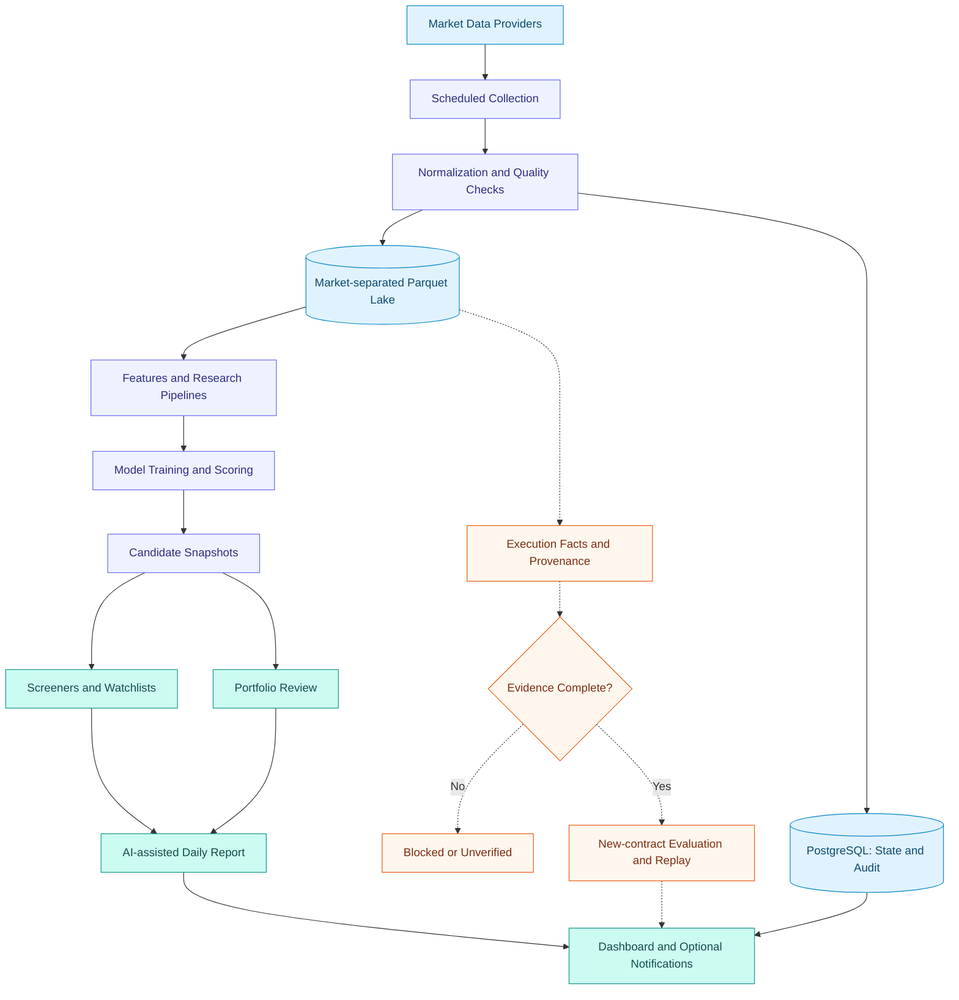

# ANA
### From market close to a clearer research agenda.

**A local-first quantitative research workspace for A-shares and U.S. equities.**

[English](README.md) · [简体中文](README.zh-CN.md)

**Collect → Screen → Evaluate → Review**

---

## One workspace for the next trading day

ANA brings end-of-day market data, quantitative screening, watchlists, portfolio review, and AI-assisted reports into a single workspace. Background jobs prepare results; the interface helps you inspect them and decide what deserves further research.

Built for deliberate post-close analysis—not high-frequency execution or automated brokerage trading.

| Discover | Understand | Stay in control |
| :--- | :--- | :--- |
| Explore model-ranked candidates and market context. | Inspect evaluations, data quality, and research history. | Review holdings, job status, and daily summaries together. |

## What you can do

- **Follow two markets.** Separate A-share and U.S. refresh workflows and market-quality checks.
- **Screen with context.** Model-driven candidate lists alongside market, sector, and watchlist views.
- **Review your portfolio.** Holdings, performance, and review suggestions, with sensitive amounts hidden until revealed.
- **Read the daily picture.** AI-assisted summaries and configurable Feishu notifications.
- **Inspect the process.** Background job status, model evaluations, failures, and source diagnostics.
- **Keep research local.** PostgreSQL for application state; a Parquet lake for market history.

Availability depends on provider permissions, configuration, data freshness, and completed jobs. AI reports may be unavailable when their inputs are not ready.

## System logic

Solid paths summarize the application workflow. Dashed paths show the execution-evidence work **under validation**, not completed production acceptance. Each market must qualify independently.

## Designed for inspection, not promises

ANA is a research tool. Model scores are not guaranteed win probabilities, historical performance does not promise future returns, and AI-generated narratives need human review.

The stricter training/evaluation/replay contract remains under validation. Incomplete execution evidence must remain blocked or unverified; legacy results must not be presented as newly validated results. This project does not claim a proven profitable strategy or fully certified execution simulation.

## Built with

| Layer | Technology |
| :--- | :--- |
| Application | Python · FastAPI · server-rendered HTML |
| State and audit | PostgreSQL |
| Historical data and analytics | Parquet · DuckDB · Polars |
| Quantitative research | LightGBM and supporting research pipelines |
| Operations | Background jobs · scheduled refreshes · notifications |

Provider support includes Tushare, HiThink Financial API, Alpaca, Polygon, and selected fallbacks. Support does not imply that every account has all historical fields or full-market coverage.

## Repository scope

Explore [application source](app/), [tests](tests/), and [scripts](scripts/).

This repository includes source, tests, dependency manifests, and generic runtime files. Internal development plans, acceptance reports, detailed deployment/configuration guides, credentials, market datasets, model artifacts, and machine-specific deployment files are intentionally excluded. Some operational scripts require local evidence or environment-specific resources not distributed here.

---

**Better research starts with visible evidence.**

Research software · Human decisions · No return guarantees

