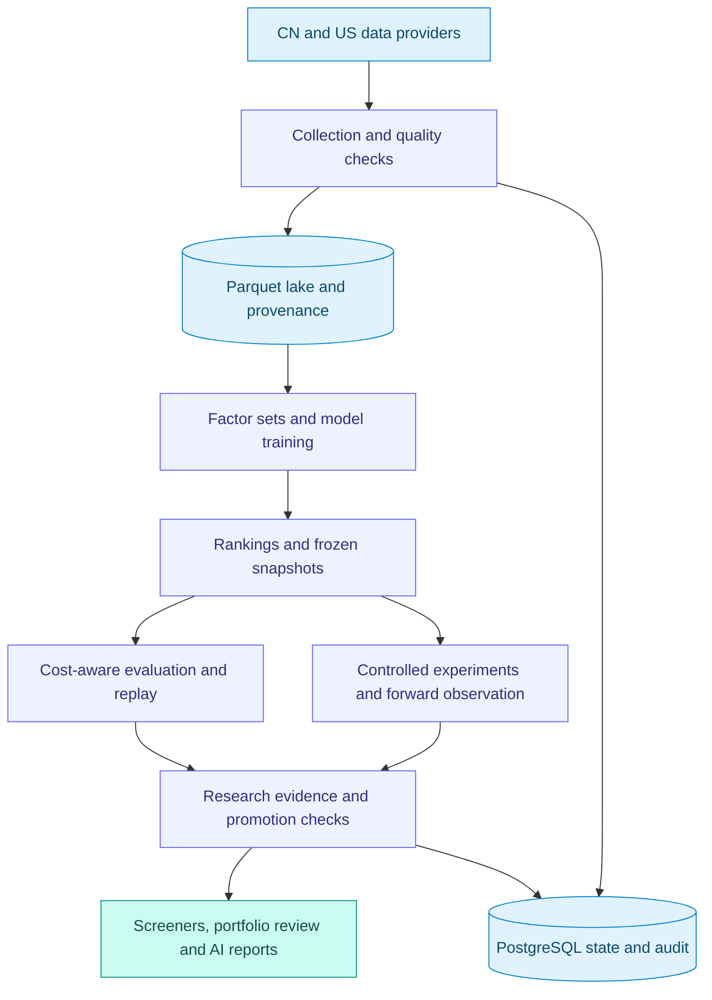

# ANA

### From market data to testable investment hypotheses.

**A local-first quantitative research platform for A-shares and U.S. equities.**

[English](README.md) · [简体中文](README.zh-CN.md)

Licensed under the [GNU Affero General Public License v3.0](LICENSE) (AGPL-3.0-only).

**Data → Factors → Models → Experiments → Research decisions**

---

## More than a stock screener

ANA connects market-data engineering, factor research, model training, cost-aware evaluation, and daily portfolio review in one inspectable workflow. Use it to ask not just **“What ranks highest?”**, but **“What evidence supports this signal—and what would invalidate it?”**

Built for researchers and developers who want access to the data, assumptions, and code behind their tools. Screeners, watchlists, portfolio views, and AI-assisted reports bring the research back into a practical post-close workspace. ANA is not a high-frequency execution system or an automated brokerage trader.

| Build a hypothesis | Challenge the result | Follow the evidence |
| :--- | :--- | :--- |
| Explore factors, model rankings, and market context. | Compare controls, costs, uncertainty, and out-of-sample results. | Inspect provenance, frozen snapshots, and daily research outputs. |

## Interface preview

*Actual application screenshot of the initial screener view, before running a screen. No stock tickers or private holdings are displayed.*

## What you can do

- **Follow two markets.** Separate A-share and U.S. refresh workflows and market-quality checks.
- **Screen with context.** Model-driven candidate lists alongside market, sector, and watchlist views.
- **Review your portfolio.** Holdings, performance, and review suggestions, with sensitive amounts hidden until revealed.
- **Read the daily picture.** AI-assisted summaries and configurable Feishu notifications.
- **Inspect the process.** Background job status, model evaluations, failures, and source diagnostics.
- **Keep research local.** PostgreSQL for application state; a Parquet lake for market history.

Availability depends on provider permissions, configuration, data freshness, and completed jobs. AI reports may be unavailable when their inputs are not ready.

## The quantitative research toolkit

The latest research pipeline adds reusable tools for testing ideas, not just displaying scores:

| Capability | What it adds |
| :--- | :--- |
| **Factor research** | Versioned factor sets, point-in-time universe inputs, cross-sectional ranking, and explicit missing-feature policies. The new `sentiment_v1` research path excludes insufficiently observed candidates instead of treating missing factors as neutral evidence. |
| **Robust model training** | Configurable label winsorization, cross-sectional MAD normalization, Huber objectives, purge/embargo windows, and ablation runs. Risk-adjusted fitting is optional; the default fit target remains net return. |
| **Cost-aware evaluation** | A shared configurable round-trip cost basis, cost-sensitivity comparisons, and raw-bar provenance for execution-contract evaluation. Compare gross and net results without silently changing their meaning. |
| **Multi-model screening** | Reliability-weighted agreement, continuous ranks, deterministic tie-breaking, and bin/isotonic probability-calibration tools. An optional probability gate abstains when probabilities are unavailable or below its threshold. |
| **Controlled experiments** | Frozen experiment specifications and dataset hashes, treated/control comparisons, date-clustered or block-bootstrap intervals, ranking sensitivity, and multiple-testing controls. |
| **Forward sentiment research** | Preregistered batches freeze the factor set, universe, costs, and availability cutoff. Immutable daily snapshots and a maturity gate support forward observation; an immature batch produces no conclusion. |

### Guardrails and traceability

- **Price-basis contracts:** shared checks for adjusted-view availability, integrity, and coverage; raw-price fallback requires explicit, auditable authorization.
- **Corporate-action controls:** event-driven backtests model supported splits and dividends. Unsupported events block a run by default; an explicit override is recorded.
- **Evidence-led promotion:** readiness, price basis, corporate-action evidence, sample size, and out-of-sample results feed a promotion decision. Explicit failures are withheld from the recommendation path.
- **Operational visibility:** read-only snapshots expose freshness, coverage, gate outcomes, and model drift. A successful data read is not itself a strategy-health certification.

These are implemented research capabilities, not proof of profitability or a claim that every integration has passed production acceptance. See the maturity notes below.

## System logic

This is a conceptual research workflow, not a guarantee that every displayed legacy run has complete evidence. Each market and model must qualify independently.

## Explore the research code

| Start here | Source |
| :--- | :--- |
| Model fitting and ablation | [Trainer](app/services/trainer.py) · [Ablation runner](scripts/run_training_ablation.py) |
| Evaluation and cost assumptions | [Evaluator](app/services/model_evaluation.py) · [Shared cost basis](app/services/cost_basis.py) |
| Reproducible comparisons | [Experiment framework](app/services/stock_selection/experiment_framework.py) · [Experiment runner](scripts/run_selection_experiment.py) |
| Reliability and calibration | [Artifact producers](app/services/stock_selection/reliability_artifacts.py) · [Calibration research](app/services/stock_selection/selective_calibration.py) |
| Forward sentiment validation | [Batch specification](app/services/stock_selection/sentiment_forward_batch.py) · [Collect / status / evaluate runner](scripts/run_sentiment_forward_batch.py) |

Scripts depend on configured providers and local research inputs; they are not a bundled, data-complete demonstration. Inspect their `--help` and source before running collection or training.

## Designed for inspection, not promises

ANA is a research tool. A ranking score is not a win probability; even a calibrated estimate is conditional on its data and validation scope. Historical performance does not promise future returns, and AI-generated narratives need human review.

The shared price-basis contract and explicit-failure promotion checks are implemented. For compatibility, legacy runs with incomplete promotion evidence can still be shown as **research-only / not promoted** unless complete-evidence enforcement is enabled. This project does not claim a proven profitable strategy or fully certified execution simulation.

### Research maturity and current limitations

- **Training chronology:** the current tradable-universe filter removes price rows before feature/label construction. Session-based features and next-open/horizon labels need additional validation wherever rows are excluded.
- **Calibration scope:** automatic artifact loading still needs stronger market/model/date isolation and stale-artifact handling. Do not treat the displayed calibrated probabilities as independently certified for every screen.
- **Sentiment evidence:** `sentiment_v1` is forward-only research, not a validated long-history alpha strategy. Its experimental panel currently selects from price-measurable rows, so missing future prices can change the evaluated top-N. Resolve this selection bias before using it to certify performance. The initial batch covers the post-close path, not auction-time validation.

Targeted tests are useful regression evidence, not a substitute for full PostgreSQL integration testing, market-by-market data qualification, or independent strategy validation.

## Built with

| Layer | Technology |
| :--- | :--- |
| Application | Python · FastAPI · server-rendered HTML |
| State and audit | PostgreSQL |
| Historical data and analytics | Parquet · DuckDB · Polars |
| Quantitative research | LightGBM and supporting research pipelines |
| Operations | Background jobs · scheduled refreshes · notifications |

Provider support includes Tushare, HiThink Financial API, Alpaca, Polygon, and selected fallbacks. Support does not imply that every account has all historical fields or full-market coverage.

## Repository scope

Explore [application source](app/), [tests](tests/), and [scripts](scripts/).

This repository includes source, tests, dependency manifests, and generic runtime files. Internal development plans, acceptance reports, detailed deployment/configuration guides, credentials, market datasets, model artifacts, and machine-specific deployment files are intentionally excluded. Some operational scripts require local evidence or environment-specific resources not distributed here.

---

**Better research starts with visible evidence.**

Research software · Human decisions · No return guarantees

[⭐ Star ANA on GitHub](https://github.com/free2way/ana-stock) · [Explore the source](https://github.com/free2way/ana-stock/tree/main) · [Report an issue](https://github.com/free2way/ana-stock/issues)

