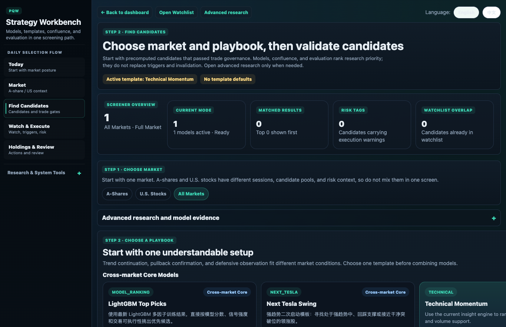
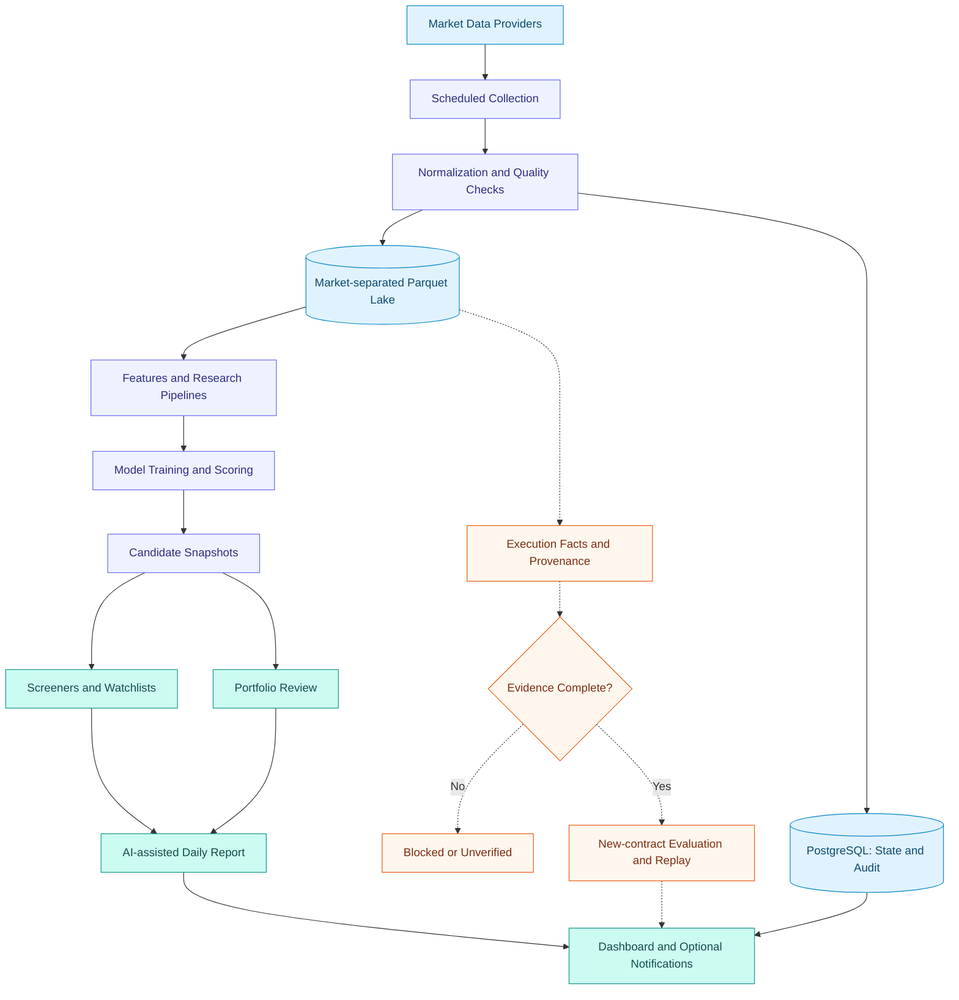

# ANA
### 从盘后数据，到更清晰的明日研究清单。

**面向 A 股与美股的本地优先量化研究工作台。**

[English](README.md) · [简体中文](README.zh-CN.md)

**采集 → 筛选 → 评估 → 复盘**

---

## 把盘后研究，放进一个工作台

ANA 将盘后行情、量化筛选、自选股、持仓复盘和 AI 日报整合在一起。后台任务准备数据和结果，前台帮助你理解市场、核查候选，形成下一交易日的研究重点。

它服务于盘后分析与人工决策，不是高频交易系统，也不会替你自动向券商下单。

| 发现机会 | 理解依据 | 掌握状态 |
| :--- | :--- | :--- |
| 联合查看模型候选与市场背景。 | 检查评测、数据质量与研究记录。 | 集中管理持仓、任务状态与每日摘要。 |

## 界面预览

*实际应用的英文选股页面截图，展示运行筛选前的初始界面，不包含股票代码或私人持仓信息。*

## 核心体验

- **双市场研究**：A 股、美股分别组织行情刷新与市场质量检查。
- **有背景的筛选**：结合候选排名、市场、行业板块与自选股开展研究。
- **持仓复盘**：查看持仓表现与复盘建议，敏感金额默认隐藏、按需显示。
- **AI 辅助日报**：汇总市场与研究结果，支持配置飞书通知。
- **过程可检查**：集中查看后台任务、模型评测、失败原因与数据源诊断。
- **本地优先存储**：PostgreSQL 管理业务状态，Parquet 保存历史行情。

功能可用性取决于数据源权限、配置、数据新鲜度及后台任务完成情况；输入未就绪时，AI 日报也可能不可用。

## 为可核查的量化研究而设计

ANA 力求让从行情数据到研究决策的关键依据都能被检查：

| 能力 | 带来的改进 |
| :--- | :--- |
| **统一价格口径** | 训练、预测与回测共享带版本的价格口径合同，检查复权视图是否存在、可读及覆盖完整；raw 价格回退必须显式授权并留下审计信息。 |
| **时间点研究约束** | 时间点数据与历史标的池检查，帮助避免把未来信息带入历史研究；滚动评估记录训练和评测窗口。 |
| **更贴近交易的回放** | 事件驱动回测处理已支持的拆股、分红，并纳入可配置交易成本与组合约束；未建模公司行为默认阻止回测，事件明细保留在审计记录中。 |
| **证据驱动的晋级** | 晋级门禁综合数据就绪度、价格口径、公司行为证据、样本规模与样本外结果；明确失败的模型会被挡在推荐路径之外。 |
| **运行状态可见** | 只读风险快照集中呈现行情新鲜度、复权覆盖、公司行为覆盖、门禁结果与模型漂移。 |

这些控制提升可追溯性，但不代表策略已证明盈利，也不代表所有数据源都具备完整历史覆盖。

## System Logic

实线展示主要工作流；虚线展示**正在验证的执行证据链**，不代表已完成生产验收。A 股、美股必须分别验证，不能相互替代。

## 让依据可见，而不是承诺收益

ANA 是研究工具。模型分数不等于经过校准的胜率，历史表现也不保证未来收益；AI 生成的文字需要人工核实。

统一价格口径合同与明确失败项的晋级拦截已实现。为兼容旧模型，证据不完整的历史运行仍可能以**仅供研究／未晋级**状态展示，除非启用完整证据强制门禁。本项目不宣称已证明稳定盈利，也不宣称成交模拟已全部验收。

## 技术构成

| 层次 | 技术 |
| :--- | :--- |
| 应用服务 | Python · FastAPI · 服务端 HTML |
| 业务状态与审计 | PostgreSQL |
| 历史数据与分析 | Parquet · DuckDB · Polars |
| 量化研究 | LightGBM 与相关研究流程 |
| 后台运行 | 后台任务 · 定时刷新 · 通知集成 |

已支持的来源包括 Tushare、同花顺 Financial API、Alpaca、Polygon 和部分备用源；接入能力不等于当前账户拥有所有历史字段或完整市场覆盖。

## 公开仓库范围

可从[应用源码](app/)、[测试](tests/)和[脚本](scripts/)了解项目。

仓库公开源码、测试、依赖清单及通用运行文件；不公开内部开发方案、验收记录、详细部署与配置文档、访问凭据、行情数据、模型产物和机器专用部署文件。部分运维脚本需要本地证据或环境资源，这些资料不会随仓库分发。

---

**更好的研究，始于可检查的证据。**

辅助研究 · 人工决策 · 不承诺收益

[⭐ 在 GitHub 为 ANA 点 Star](https://github.com/free2way/ana-stock) · [浏览源码](https://github.com/free2way/ana-stock/tree/main) · [反馈问题](https://github.com/free2way/ana-stock/issues)

