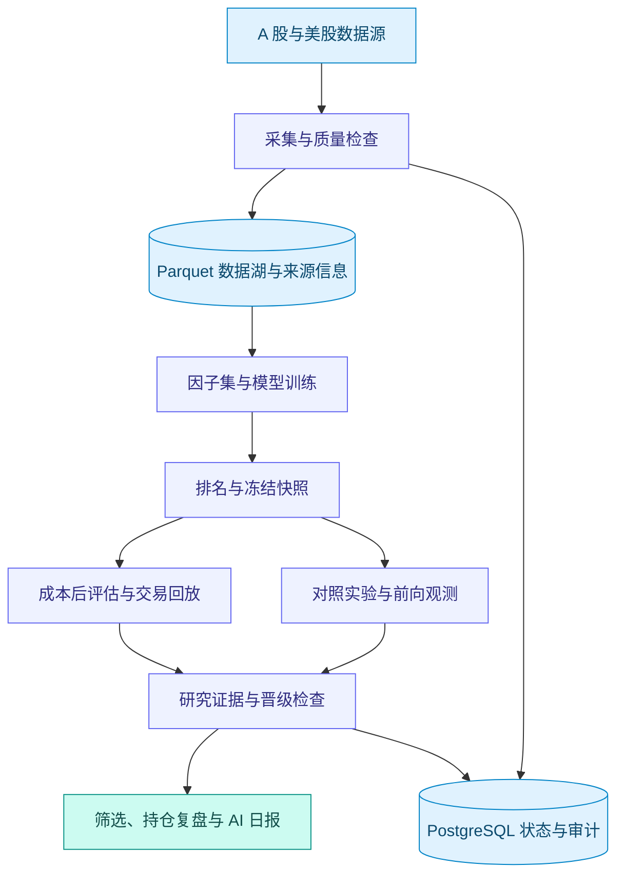

# ANA

### 从行情数据，到可检验的投资假设。

**面向 A 股与美股的本地优先量化研究平台。**

[English](README.md) · [简体中文](README.zh-CN.md)

**数据 → 因子 → 模型 → 实验 → 研究决策**

---

## 不止于选股，更关注信号背后的证据

ANA 将行情数据工程、因子研究、模型训练、成本后评估与日常持仓复盘连接起来。不只回答**“哪些股票排名靠前？”**，还帮助你追问：**“这个信号有什么依据，什么情况下会失效？”**

面向希望掌握数据、假设与源码的研究者和开发者。选股、自选股、持仓视图与 AI 日报，让研究结果回到可操作的盘后工作台。ANA 不是高频交易系统，也不会替你自动向券商下单。

| 提出假设 | 检验结果 | 跟踪证据 |
| :--- | :--- | :--- |
| 探索因子、模型排名与市场背景。 | 比较对照组、成本、不确定性与样本外结果。 | 核查数据来源、冻结快照与每日研究输出。 |

## 界面预览

*实际应用的英文选股页面截图，展示运行筛选前的初始界面，不包含股票代码或私人持仓信息。*

## 核心体验

- **双市场研究**：A 股、美股分别组织行情刷新与市场质量检查。
- **有背景的筛选**：结合候选排名、市场、行业板块与自选股开展研究。
- **持仓复盘**：查看持仓表现与复盘建议，敏感金额默认隐藏、按需显示。
- **AI 辅助日报**：汇总市场与研究结果，支持配置飞书通知。
- **过程可检查**：集中查看后台任务、模型评测、失败原因与数据源诊断。
- **本地优先存储**：PostgreSQL 管理业务状态，Parquet 保存历史行情。

功能可用性取决于数据源权限、配置、数据新鲜度及后台任务完成情况；输入未就绪时，AI 日报也可能不可用。

## 量化研究工具链

最新研究流程提供可复用的假设检验工具，而不只是展示分数：

| 能力 | 带来的改进 |
| :--- | :--- |
| **因子研究** | 带版本的因子集、时间点标的池输入、截面排名和明确的缺失特征策略。新增 `sentiment_v1` 研究路径排除观测不足的候选，不把缺失因子当成中性证据。 |
| **稳健模型训练** | 可配置标签缩尾、截面 MAD 标准化、Huber 目标、训练隔离窗口及消融实验。风险调整目标拟合为可选项，默认拟合目标仍为净收益。 |
| **成本后评估** | 共享可配置的双边交易成本口径，提供成本敏感性比较，并为执行合同评估保留原始行情来源。区分毛收益与净收益，避免悄然更换统计口径。 |
| **多模型筛选** | 可靠性加权共识、连续排名、确定性同分排序，以及分箱／保序概率校准工具。可选概率门槛在概率缺失或低于阈值时不入选。 |
| **对照实验** | 冻结实验配置与数据集哈希，支持实验组／对照组比较、按日期聚类或分块自助法置信区间、排名敏感性与多重检验控制。 |
| **情绪前向研究** | 预注册批次冻结因子集、标的池、成本和特征可用时间。不可变每日快照与成熟度门禁支持前向观测，批次未成熟时不输出结论。 |

### 风险约束与可追溯性

- **价格口径合同**：共享复权视图可用性、完整性与覆盖检查；raw 价格回退必须显式授权并留下审计记录。
- **公司行为控制**：事件驱动回测处理已支持的拆股与分红；未支持事件默认阻止运行，显式放行会被记录。
- **证据驱动晋级**：数据就绪度、价格口径、公司行为证据、样本规模及样本外结果共同参与判断；明确失败项被挡在推荐路径之外。
- **运行状态可见**：只读快照呈现数据新鲜度、覆盖、门禁结果及模型漂移。成功读取数据不等于策略健康认证。

以上是已实现的研究能力，不代表策略已经证明盈利，也不代表每条集成路径都通过了生产验收。当前边界见下方“研究成熟度”。

## 平台研究流程

这是概念性研究流程，不保证所有展示的旧版运行都具备完整证据。每个市场、每个模型都需要独立验证。

## 从源码了解研究能力

| 研究入口 | 源码 |
| :--- | :--- |
| 模型拟合与消融 | [训练器](app/services/trainer.py) · [消融运行器](scripts/run_training_ablation.py) |
| 评估与成本假设 | [评估器](app/services/model_evaluation.py) · [共享成本口径](app/services/cost_basis.py) |
| 可复核的实验比较 | [实验框架](app/services/stock_selection/experiment_framework.py) · [实验运行器](scripts/run_selection_experiment.py) |
| 可靠性与校准 | [产物生成器](app/services/stock_selection/reliability_artifacts.py) · [校准研究](app/services/stock_selection/selective_calibration.py) |
| 情绪前向验证 | [批次协议](app/services/stock_selection/sentiment_forward_batch.py) · [采集／状态／评估运行器](scripts/run_sentiment_forward_batch.py) |

脚本依赖已配置的数据源与本地研究输入，并非附带完整行情的一键演示。执行采集或训练前，请检查 `--help` 与源码。

## 让依据可见，而不是承诺收益

ANA 是研究工具。排名分数不等于胜率；即便是经过校准的估计，也受数据和验证范围约束。历史表现不保证未来收益，AI 生成的文字需要人工核实。

统一价格口径合同与明确失败项的晋级拦截已实现。为兼容旧模型，证据不完整的历史运行仍可能以**仅供研究／未晋级**状态展示，除非启用完整证据强制门禁。本项目不宣称已证明稳定盈利，也不宣称成交模拟已全部验收。

### 研究成熟度与当前限制

- **训练时间轴**：当前可交易标的池过滤在特征／标签构建前删除行情行；存在被排除日期时，按交易日计算的特征、下一开盘入场及持有期标签仍需进一步校验。
- **校准适用范围**：自动加载的校准产物仍需加强市场／模型／日期隔离与过期产物处理，不应将页面校准概率视为已逐项独立认证的结果。
- **情绪研究证据**：`sentiment_v1` 属于前向研究，不是已经验证的长期历史 Alpha。当前实验面板从价格可测量的样本中选取 top-N，未来价格缺失可能改变评估名单；在用于绩效认证前需消除这一选择偏差。首批覆盖盘后路径，不包含集合竞价时点验证。

定向测试是回归证据，不能替代完整 PostgreSQL 集成测试、分市场数据验收或独立策略验证。

## 技术构成

| 层次 | 技术 |
| :--- | :--- |
| 应用服务 | Python · FastAPI · 服务端 HTML |
| 业务状态与审计 | PostgreSQL |
| 历史数据与分析 | Parquet · DuckDB · Polars |
| 量化研究 | LightGBM 与相关研究流程 |
| 后台运行 | 后台任务 · 定时刷新 · 通知集成 |

已支持的来源包括 Tushare、同花顺 Financial API、Alpaca、Polygon 和部分备用源；接入能力不等于当前账户拥有所有历史字段或完整市场覆盖。

## 公开仓库范围

可从[应用源码](app/)、[测试](tests/)和[脚本](scripts/)了解项目。

仓库公开源码、测试、依赖清单及通用运行文件；不公开内部开发方案、验收记录、详细部署与配置文档、访问凭据、行情数据、模型产物和机器专用部署文件。部分运维脚本需要本地证据或环境资源，这些资料不会随仓库分发。

---

**更好的研究，始于可检查的证据。**

辅助研究 · 人工决策 · 不承诺收益

[⭐ 在 GitHub 为 ANA 点 Star](https://github.com/free2way/ana-stock) · [浏览源码](https://github.com/free2way/ana-stock/tree/main) · [反馈问题](https://github.com/free2way/ana-stock/issues)

