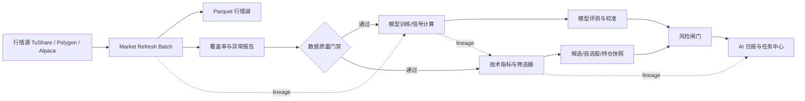

# 股票量化分析应用进一步优化技术方案

日期：2026-07-22  
适用范围：A 股、美股收盘行情、模型计算、筛选器、风险控制、日报和任务中心

## 1. 结论与目标

当前系统已经具备可用的主链路：PostgreSQL 保存业务状态，Parquet 保存行情湖，后台 Job 运行模型和筛选器，页面读取预计算快照。

下一阶段目标不是继续增加页面数量，而是把系统从“能够运行”提升为“每天可验证、可追溯、不会使用过期输入的分析系统”。最终要求：

1. 能区分正常交易、停牌/无交易、未上市/非活跃、数据源失败。
2. 每个下游结果都能说明使用了哪一个行情日期、哪一次模型运行和哪一个 Job。
3. 上游数据不完整时，模型、筛选和日报自动阻断或明确降级，不显示为正常成功。
4. 用户能在任务中心看到当日链路是否完整、具体缺失标的和失败原因。
5. 模型命中率、收益、回撤和不同市场状态下的表现可以持续评估。

本项已进入实施：以 `model_evaluations` 和 `model_evaluation_metrics` 作为统一口径，样本必须关联预测日的市场状态快照；没有同日快照的历史样本单列为 `unclassified`，不允许用当前状态回填。

## 2. 当前主要问题

### 2.1 行情覆盖率和“最新”定义不一致

- 行情湖可能已经有最新交易日，但单个标的同步状态仍然过期。
- 停牌股票没有日线记录，不能简单按“刷新失败”处理。
- 全局健康检查只看行情湖最大日期时，会掩盖少量标的缺失。
- 美股 grouped daily 是全市场批量结果，和逐标的 `price_sync_state` 的语义不同。

### 2.2 Job 成功不等于下游结果可用

- `DataJob` 记录开始、结束和状态，但依赖关系、输入日期、覆盖率、重试次数没有结构化字段。
- 模型、筛选、日报可以存在旧快照，页面如果只取“最新一条记录”可能读到过期结果。
- 组合筛选、模型指导、命中率快照可能比行情和预测落后数天。

### 2.3 数据模型仍有审计缺口

- 持仓和交易日志主要放在 `AppSetting` JSON 中，不适合做严格的成交、费用、币种和已实现盈亏审计。
- `WorkspaceSnapshot.payload_json` 灵活，但没有统一 schema、版本和输入数据指纹。
- 模型评测主要依赖快照，缺少按市场状态、模型版本、持有周期拆分的标准化评测表。

## 3. 目标架构



核心原则：所有下游产物都必须携带 `market`、`input_as_of_date`、`source_job_id`、`model_run_id`（如适用）、`schema_version`。

## 4. 数据质量与停牌处理方案

### 4.1 标准状态

| 状态 | 含义 | 是否阻断下游 |
|---|---|---:|
| `success` | 已取得目标交易日有效行情 | 否 |
| `no_trade` | 数据源明确报告目标日停牌/无交易 | 否，计入已解释覆盖 |
| `inactive` | 标的已退市、非活跃或不在交易 universe | 否，排除出活跃覆盖率 |
| `partial` | 有历史数据但目标日仍缺失，原因未确认 | 是 |
| `missing` | 没有任何可用行情状态 | 是 |
| `failed` | 数据源、网络或写入异常 | 是 |

`no_trade` 只能在数据源明确返回停牌信息时写入；没有明确证据时，保持 `partial`，避免把供应商故障误判为停牌。

### 4.2 覆盖率计算

对每个市场和活跃 universe 计算：

```text
有效覆盖率 = (success + no_trade + inactive) / 活跃标的总数
阻断数 = partial + missing + failed
```

门禁默认要求阻断数为 0。对于观察类任务可允许降级，但必须在结果和页面上显示降级原因，不能伪装成成功。

### 4.3 行情批次记录

新增 `market_refresh_batches`（或等价表），建议字段：

- `id`、`market`、`provider`
- `requested_as_of_date`、`actual_as_of_date`
- `universe_count`、`success_count`、`no_trade_count`、`inactive_count`
- `partial_count`、`missing_count`、`failed_count`
- `started_at`、`finished_at`、`status`
- `error_summary_json`、`source_job_id`

保留现有 `price_sync_state` 作为“每个标的最后状态”，批次表用于审计和质量统计。

## 5. Job 编排与门禁

### 5.1 标准每日链路

```text
行情刷新
  -> 行情覆盖率检查
  -> 技术指标
  -> A 股/美股模型训练或信号刷新
  -> 单模型筛选
  -> 多模型组合筛选
  -> 风险闸门
  -> 模型校准/命中率快照
  -> AI 日报
  -> 工作台快照
```

每个 Job 在启动前检查上游 Job 的：

- `status == success` 或允许的解释性状态；
- `actual_as_of_date >= required_as_of_date`；
- `blocking_count == 0`；
- 输入快照和模型运行 ID 是否匹配。

### 5.2 Job 数据模型改造

建议将当前 `DataJob` 拆成：

1. `job_definitions`：任务名称、分类、市场、调度规则、超时和重试策略。
2. `job_runs`：每次执行实例、状态、耗时、输入日期、输出日期、结果摘要。
3. `job_run_dependencies`：上游运行 ID、依赖类型、阻断原因。
4. `job_run_attempts`：每次重试、异常、provider 和耗时。

现有 `DataJob.params_json` 可以保留作为扩展字段，但不能继续承担依赖和质量事实的唯一存储职责。

### 5.3 幂等和失败恢复

- 同一市场、同一目标日期的行情批次使用幂等键。
- 同一 `model_run_id + ticker + trade_date` 继续使用唯一约束。
- 下游 Job 失败重试时复用输入批次，不重新生成不一致的行情日期。
- 超时任务自动标记为 `failed_timeout`，并保留最后心跳和异常。

## 6. 快照和模型结果新鲜度

### 6.1 快照统一元数据

所有 `WorkspaceSnapshot` payload 增加：

```json
{
  "schema_version": 1,
  "market": "CN",
  "input_as_of_date": "2026-07-22",
  "source_job_id": 123,
  "source_model_run_id": 456,
  "coverage": {
    "total": 5202,
    "success": 5180,
    "no_trade": 22,
    "blocking": 0
  }
}
```

### 6.2 读取规则

- 页面读取快照前必须校验 `input_as_of_date`。
- 过期快照可以用于历史页，但不能用于“今日候选”“今日日报”或买入闸门。
- 没有当前日期快照时，页面显示“等待计算”，而不是自动回退到几天前结果。
- AI 日报必须列出使用的行情日期、模型运行日期和降级原因。

### 6.3 模型评测模型

新增 `model_evaluations` 和 `model_evaluation_metrics`：

- 模型、市场、训练/测试区间、模型版本；
- 预测日期、持有周期（1/3/5/10/20 日）；
- 命中率、平均收益、超额收益、最大回撤、换手率；
- 市场状态（趋势、震荡、暴跌、反弹失败等）；
- 样本数和置信区间；
- 是否样本外、是否包含交易成本。

当前已落地评测主表、分周期指标、市场状态分组、交易成本与置信区间；模型评测页读取落库总体指标，API 同时暴露市场状态切片。模型指导、校准和组合选择仍逐步迁移到该统一口径，快照在迁移完成后只作为缓存。

为避免未复权的拆股/反向拆股价格跳变伪造成异常收益，评测会排除持有路径中单日绝对涨跌幅不低于 80% 的疑似公司行为路径，并在评测摘要中记录排除数量。

## 7. 持仓数据模型升级

将 `AppSetting` JSON 逐步迁移为：

- `portfolios`：账户、市场、币种、基准；
- `positions`：当前数量、平均成本、冻结数量、最新估值；
- `trades`：买卖、成交价、数量、费用、税费、成交时间、来源；
- `cash_ledger`：入金、出金、分红、汇率和现金余额；
- `position_daily_metrics`：市值、收益、回撤、风险贡献。

迁移期间保留 JSON 只读兼容层；所有新增写入统一进入关系表，并保留原始导入快照。

## 8. 模型和风险优化

### 8.1 暴跌/暴涨行情保护

- 增加市场级熔断条件：指数跌幅、涨跌停家数、波动率、成交额异常。
- 个股级别增加跳空、连续跌停、流动性骤降和异常成交量标签。
- 风险闸门输出 `ALLOW`、`REVIEW`、`BLOCK`，并记录触发规则版本。
- `BLOCK` 时仍可展示候选，但不能给出正常买入优先级。

### 8.2 模型组合

- 组合模型采用滚动样本外评测，不按单次命中率选冠军。
- 组合权重按近期稳定性、回撤、市场状态适配度和样本数共同决定。
- 低样本模型只显示“观察”，不进入默认组合。
- 结果中同时显示收益、命中率、盈亏比和最大回撤，避免只优化命中率。

## 9. 任务中心改造

任务中心按以下层级展示：

1. **今日必跑**：行情、技术指标、模型、筛选、风险、日报。
2. **维护任务**：基本面、概念、清理、模型评测、数据库维护。
3. **历史运行**：按日期、市场、Job 类型筛选。

每个任务详情展示：

- 输入行情日期和覆盖率；
- 上游依赖和阻断原因；
- 每个状态计数及失败标的；
- 输出快照、模型运行和报告链接；
- 重试按钮和安全的“强制运行”按钮。

页面颜色只表达质量：绿色=通过，黄色=解释性降级，红色=阻断，灰色=未执行。

## 10. 性能、存储和可观测性

- PostgreSQL 只存业务状态、任务、快照和审计；行情历史继续放 Parquet。
- `WorkspaceSnapshot` 按类型和日期建立索引，旧快照按保留策略归档。
- 大型 JSON payload 增加压缩或拆分策略，避免单条快照过大。
- 每个 Job 记录 provider、请求数量、写入行数、耗时、失败率和重试次数。
- 增加结构化日志、Job correlation ID 和每日质量摘要。
- 保留 `/health` 作为进程探活，`/health/ready` 同时检查数据库、行情湖和活跃标的覆盖率。

## 11. 分阶段实施顺序

### P0：先解决“错误结果被当成最新结果”

1. 完成停牌/无交易/未活跃状态标准化。
2. 完成行情覆盖率和下游数据质量门禁。
3. 所有模型、筛选、日报读取时校验输入日期。
4. 修复当前过期的模型指导、校准、命中率和组合筛选 Job。
5. 任务中心显示阻断原因和具体标的。

### P1：补齐可审计的数据模型

1. 增加行情批次、Job 依赖和 Job 尝试记录。
2. 增加模型评测和市场状态维度。
3. 增加快照 schema 版本和来源指纹。
4. 将持仓/交易从 JSON 迁移到关系表。

### P2：提高收益质量和运行效率

1. 滚动样本外组合优化。
2. 暴跌/暴涨专用风险模型和预警。
3. Parquet 分区、快照压缩和历史归档。
4. 端到端回归测试、故障注入和恢复演练。

## 12. 验收标准

### 数据质量

- 正常交易标的目标日覆盖率 100%。
- 停牌标的全部有明确 `no_trade` 证据。
- `partial/missing/failed` 标的数量为 0 时，模型链路才允许标记成功。
- 健康检查同时显示行情湖日期和活跃标的覆盖率。

### 结果新鲜度

- 今日候选、风险和日报不得读取旧于目标交易日的快照。
- 每个结果可追溯到行情批次、Job Run 和模型运行。
- 任何降级结果都显示原因和影响范围。

### 模型质量

- 每个默认模型至少有样本外 1/3/5/10 日评测。
- 评测报告同时包含命中率、收益、盈亏比、最大回撤和样本数。
- 暴跌/暴涨阶段单独统计，不与普通行情混在一起。

### 运维

- Job 超时、失败、重复触发和下游阻断均有可查询记录。
- 手工重跑不会产生重复预测或重复快照。
- 数据库、行情湖和任务历史均可独立备份和恢复。

## 13. 近期执行清单

建议下一轮按以下顺序实际开发：

1. 完成当前 `no_trade` 和覆盖率门禁的生产验证。
2. 给模型训练、核心筛选、组合筛选和 AI 日报补齐统一输入元数据。
3. 新增行情批次和 Job 依赖表，并改造任务中心详情页。
4. 强制重跑过期的模型校准、模型指导、命中率和组合快照。
5. 建立模型评测表后，再进行组合权重和收益优化。
